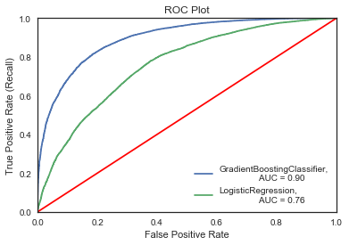
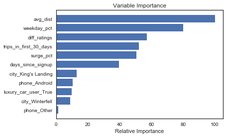
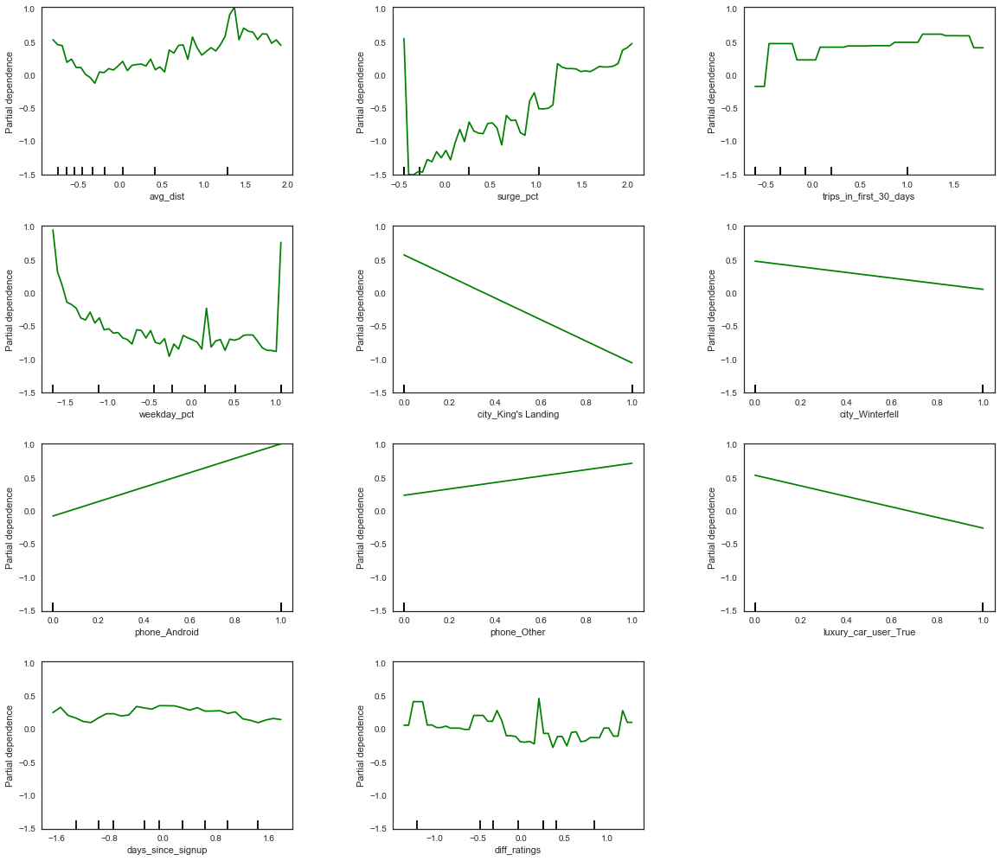

# Predicting Churn For a Major Ride Sharing Company in San Francisco

## Premise
The premise of this project is to predict churn for a ride-sharing company. A ride-sharing company (Company X) is interested in predicting rider retention.
To help explore this question, we are analyzing a sample dataset of a cohort of
users who signed up for an account in January 2014. The data was pulled on July
1, 2014; we consider a user retained if they were “active” (i.e. took a trip)
in the preceding 30 days (from the day the data was pulled). In other words, a
user is "active" if they have taken a trip since June 1, 2014.

The goal is help understand what factors are the best predictors for retention and offer suggestions to implement and use those insights to help Company X.

__Note:__ As this is real data the company has asked that both the name of the company and the data be redacted.

## Work Flow
We used python, jupyter notebooks, various models from scikit-learn to attempt to cluster and predict churn. Outlined below is our workflow

1. Clean the data and classify churn  
  *  Convert all date times to proper data type for analysis
  *  Use the *last_trip_date* to create a churn column, and then drop that column to prevent data leakage
  *  Create dummy variables

1.  Create new features and do any necessary feature engineering
  *  Create a days since sign up feature
  *  Create a difference in rating between the average rating by driver and the average rating of driver

1. Split the data, fill NAN's, and scale all non-categorical data

1. Run through various vanilla predictive models that allow for interpretation of the features. Determine which model preforms best using an F-score.

1. Perform a gridsearch to determine the best set of hyper parameters for the selected model.

1. Create various visualizations that might help to explain which features are important in our model.

1. Make recommendations to Company X.

## Results and recommendations

__Note:__ To follow along please open the jupyter notebook *mickeys_churn_notebook.ipynb*. All additional code can be found in the associated cleaning and visualization .py files.

We found a gradient boosting tree method was the best model to use on this data. A full explanation on why can be found in the attached notebook, however the ROC plot below will give you a quick and dirty showing of how much better a GBC preformed compared to a basic logistic regression.

By looking at a feature or variable importance plot from the tree method we were able to discern which features where important

This plot shows that there are 6 features that the model predominantly splits on.
* The average distance of the ride
* The percent of rides taken during the weekday
* The difference in ratings between the rider and driver
* The number of trips in the first 30 days
* The average surge percentage
* Days since signup

To actually determine how these features effect churn and in which direction they move we have to use partial dependency plots.

Using these plots we can determine how each of our top 6 features effect the likelihood of churn. These plots represent essentially the derivative of churn with respect to each variable. As a result a value less than zero, means that as the feature increases churn decreases, a number greater than zero means that churn increases as the variable increases.

|Feature|Description|
|-------|-----------|
|Avg. Dist | At either really short or really long rides people are more likely to churn, generally though, the longer the ride the more likely to churn
|Weekday Percentage| When people user the service on only weekends or weekdays they are more likely to churn|
|Diff in Rating | If there is a difference in rating between the driver and rider there is a higher likelihood to churn|
|Number of trips in first 30 days | The more trips people took in the first 30 days, the more likely they are to churn|
|Average Surge Percentage | As average surge increases the change in churn increases
| Days since sign up | Basically all this says is that the longer a customer is a member, the more likely they are to no longer to be active. The rate appears to be constant
